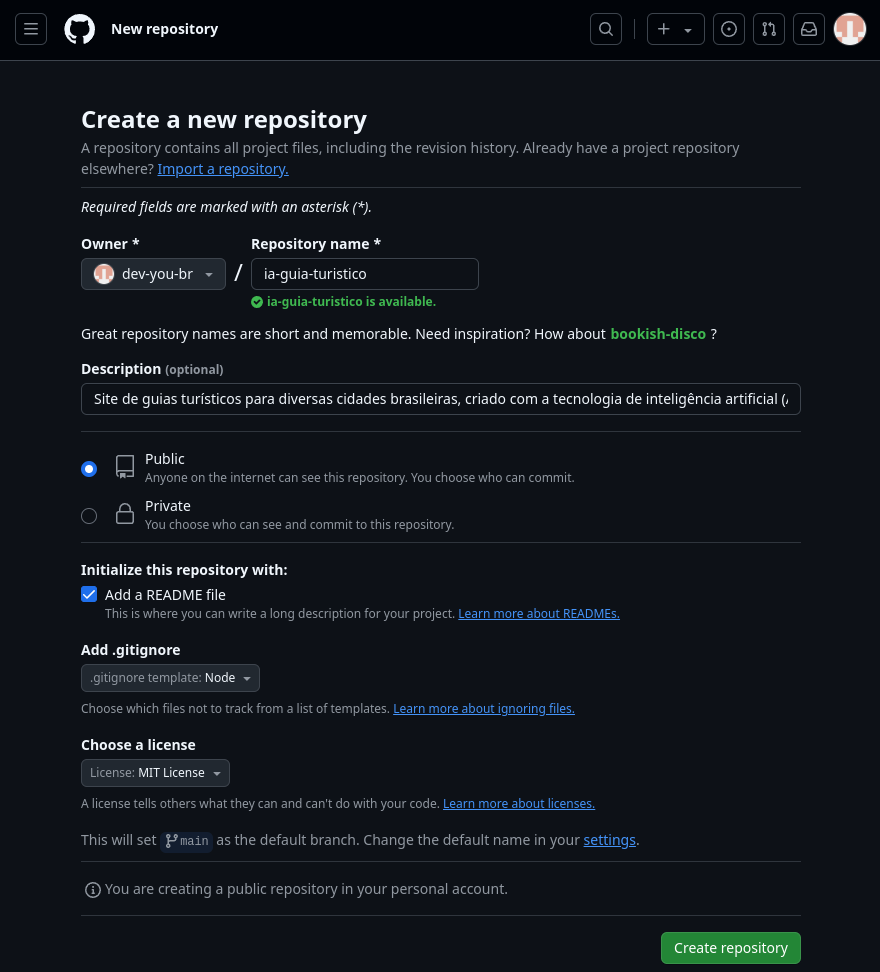

# IA Guia Turístico

Neste projeto, desenvolveremos tudo do zero. Será uma excelente oportunidade para aprimorarmos nossos conhecimentos e utilizarmos como base para futuros projetos.

Vamos construir um site que oferece guias turísticos para diversas cidades brasileiras, utilizando inteligência artificial (IA) com a tecnologia Llama, TypeScript e hospedado no GitHub Pages.

## Demo

Este projeto está hospedado no GitHub Pages: https://dev-you-br.github.io/ia-guia-turistico

## Criando um Repositório no GitHub

Crie um novo repositório no GitHub:



Clone o repositório na sua máquina local:

```sh
git clone git@github.com:dev-you-br/ia-guia-turistico.git
```

## Preparar o Projeto

Crie um arquivo `.nvmrc` para definir a versão do Node usada no projeto:

```sh
node -v > .nvmrc
```

Outros desenvolvedores podem carregar a mesma versão do Node com:

```sh
nvm use
```

Inicialize o projeto com npm:

```sh
npm init -y
```

Instale o TypeScript e suas dependências:

```sh
npm install typescript --save-dev
npm install @types/node --save-dev
npm install --save-dev @tsconfig/node22
npm install --save-dev @tsconfig/strictest
```

Configure o `tsconfig.json`:

```sh
echo '{
  "extends": ["@tsconfig/strictest/tsconfig.json", "@tsconfig/node22/tsconfig.json"],
  "compilerOptions": {
    "rootDir": "src",
    "outDir": "dist"
  }
}' > tsconfig.json
```

Instale `csv-parser` para leitura de arquivos CSV:

```sh
npm install csv-parser
```

Instale `axios` para requisições HTTP:

```sh
npm install axios
```

Instale `@ts-stack/markdown` para conversão de Markdown para HTML:

```sh
npm install @ts-stack/markdown --save
```

Crie o diretório `src` para armazenar o código-fonte:

```sh
mkdir src
```

## Configurar o Prettier (opcional)

Instale o Prettier:

```sh
npm install --save-dev --save-exact prettier
```

Configure o Prettier criando os arquivos `.prettierrc` e `.prettierignore`:

```sh
echo '{
  "semi": false,
  "singleQuote": true
}
' > .prettierrc

echo 'build
coverage
package-lock.json
ollama/' > .prettierignore
```

## Desenvolvimento do Projeto

### Obtenção da Lista de Cidades Brasileiras

Baixe a lista de cidades brasileiras por população no site do [IBGE](https://ftp.ibge.gov.br/Estimativas_de_Populacao/Estimativas_2021/).
Limpe o arquivo no Excel, removendo cabeçalhos e rodapés, e exporte para `.csv` no caminho [./resources/cities.csv](./resources/cities.csv).

Exemplo de arquivo:

```csv
UF,COD_UF,COD_MUNICIPIO,NOME_DO_MUNICIPIO,POPULACAO_ESTIMADA
RO,11,00015,Alta Floresta D'Oeste,22516
RO,11,00023,Ariquemes,111148
RO,11,00031,Cabixi,5067
RO,11,00049,Cacoal,86416
```

### Geração da Lista de Cidades em JSON

Implemente a funcionalidade que vai gerar uma lista de cidades em JSON.

Crie o arquivo [./src/make-cities.ts](./src/make-cities.ts) e implemente a funcionalidade que ler o arquivo [./resources/cities.csv](./resources/cities.csv) e converte em [./resources/cities.json](./resources/cities.json) mapeando os campos como abaixo:

| csv                | json           |
| ------------------ | -------------- |
| UF                 | region         |
| NOME_DO_MUNICIPIO  | name           |
| NOME_DO_MUNICIPIO  | nameNormalized |
| POPULACAO_ESTIMADA | population     |

Normalize o nome das cidades no campo `nameNormalized`. Por exemplo, `São Paulo` deve ser normalizado para `sao-paulo`.
Inclua somente as 20 cidades mais populosas no resultado final.

Crie um script de execução:

```sh
npm run make-cities
```

### Inicie o Servidor Llama

Siga os passos do vido anterior ??? para iniciar o servidor Llama em sua máquina.

### Criação do Conteúdo Turístico das Cidades

Implemente a funcionalidade que vai gerar o guia turístico de cada cidade.

Crie o arquivo [./src/make-cities-content.ts](./src/make-cities-content.ts) e implemente a funcionalidade que ler o arquivo [./resources/cities.json](./resources/cities.json). Para cada cidade, envie um prompt para o Llama gerar um guia turístico e salve o conteúdo em um arquivo HTML em [./resources/content/](./resources/content/). Utilize o campo `nameNormalized` para o nome do arquivo. Por exemplo `sao-paulo.html`.

Crie o diretório `./resources/content`:

```sh
mkdir resources/content
```

Crie um script de execução:

```sh
npm run make-cities-content
```

### Criação do Layout para as Páginas

Crie o layout padrão em [./resources/layout/layout.html](./resources/layout/layout.html) que deve incluir um link para a página inicial e uma marcação `{{CONTENT}}` que posteriormente será substituído com o conteúdo. Outros arquivos de layout podem ser salvos no diretório [./resources/layout](./resources/layout/).

### Criação da Página Inicial

Implemente a funcionalidade que criará a páginina inicial.

Crie o arquivo [./src/make-index-page.ts](./src/make-index-page.ts) que copia o directório [./resources/layout/](./resources/layout/) para [.docs/](./docs/). Leia or arquivos [./resources/cities.json](./resources/cities.json) e [./resources/layout/layout.html](./resources/layout/layout.html) e crie uma lista de links para cada cidade e substitua pela marcação `{{CONTENT}}` do arquivo de layout. Por exemplo:

```html
<p><a href="sao_paulo.html">São Paulo</a></p>
<p><a href="rio_de_janeiro.html">Rio de Janeiro</a></p>
` ...
```

Escreva o resultado em [./docs/index.html].

Crie o diretório `./docs`:

```sh
mkdir docs
```

Crie um script de execução:

```sh
npm run make-index-page
```

### Geração do Guia Turístico

Implemente a funcionalidade que criará a página de guia turístico de cada cidades.

Crie o arquivo [./src/make-cities-pages.html](./src/make-cities-pages.ts) e leia os arquivos
[./resources/cities.json](./resources/cities.json) e [./resources/layout.html](./resources/layout.html).
Para cada cidade, leia o conteúdo correspondent do diretório [./resources/content](./resources/content/) e
substitua pela marcação `{{CONTENT}}` do arquivo de layout.

Escreva o resultado em [./docs/](./docs/).
Por exemplo, para a cidade `São Paulo`, crie o arquivo `./docs/sao-paulo.html`.

Crie um script de execucão:

```sh
npm run make-cities-pages
```

# Referencias

- [How to Setup a TypeScript + Node.js Project](https://khalilstemmler.com/blogs/typescript/node-starter-project/)
