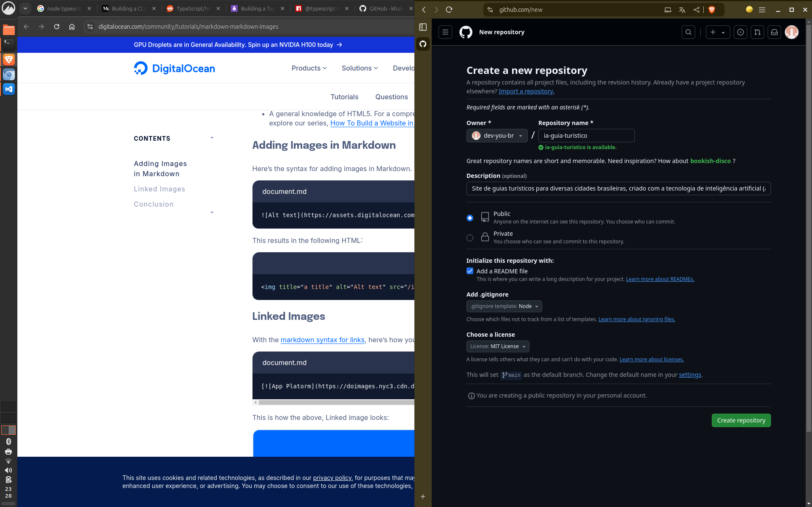

# AI Guia Turístico
Este site oferece guias turísticos para diversas cidades brasileiras, criado com a tecnologia de inteligência artificial (AI) do Llama, TypeScript e hospedado no GitHub Pages.

Neste projeto, vamos desenvolver tudo do zero. Será uma excelente oportunidade para aprimorarmos nossos conhecimentos e utilizarmos como base para futuros projetos.

## Criando um Repositório no GitHub
Crie um novo repositório no GitHub:



Agora clone am sua maquina:

```bash
git clone git@github.com:dev-you-br/ia-guia-turistico.git
```
## Preparar o projeto

Crie um arquivo `.nvmrc` para guardar a versao to Node que vamos utilizar no projeto.
```bash
node -v > .nvmrc
```

Outros desenvolvedores pode carregar a mesma versao do Node com:
```bash
nvm use
```

# Referencias

[Building a TypeScript CLI with Node.js and Commander](https://blog.logrocket.com/building-typescript-cli-node-js-commander/)